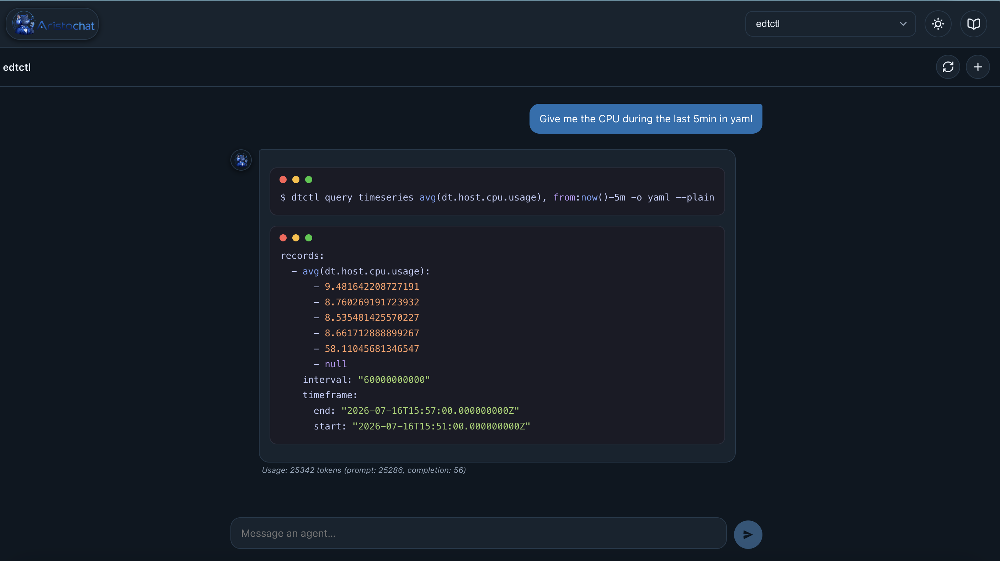
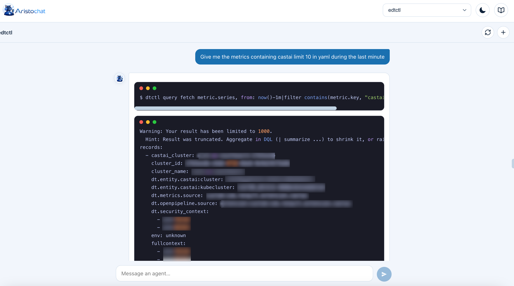

# aristochat

This chat is a web interface similar to chatGPT for CWCloud's agents like [`cwc`](https://www.cwcloud.tech/docs/tutorials/cli/public/#create-a-web-agent), [`qwctl`](https://www.cwcloud.tech/docs/tutorials/observability/qwctl/#create-a-web-agent) or [`edtctl`](https://www.cwcloud.tech/docs/tutorials/observability/edtctl/#create-a-web-agent).





## Complete documentation

You can find the complete documentation [here](https://www.cwcloud.tech/docs/tutorials/aristochat).

## Getting started

### Using npm

#### Build

```sh
cd aristochat-ui
npm install
npm start
```

`aristochat-ui/.env.development` contains a sample `REACT_APP_AGENTS_ENDPOINTS` so the app has agents to pick from out of the box; edit it to point at real agent URLs.

### Configuring agents

`REACT_APP_AGENTS_ENDPOINTS` is a JSON array of agents:

```json
[
  { "name": "cwc", "url": "https://cwc.cwcloud.tech", "headers": { "Authorization": "Bearer <token>" } },
  { "name": "qwctl", "url": "https://qwctl.cwcloud.tech", "credentials": { "username": "admin", "password": "admin" } },
  { "name": "edtctl", "url": "https://edtctl.cwcloud.tech" }
]
```

`headers`, `credentials` (turned into HTTP Basic auth), or neither may be provided per agent.

## Using docker

```sh
docker compose up --build --force-recreate
```

Note: __any double quote in the `AGENTS_ENDPOINTS` environment variable must be backslash-escaped__ (`\"`) or the substitution will produce invalid JavaScript.

A public image is available here `rg.fr-par.scw.cloud/aristochat-g3kljh/aristochat-ui:latest`.
